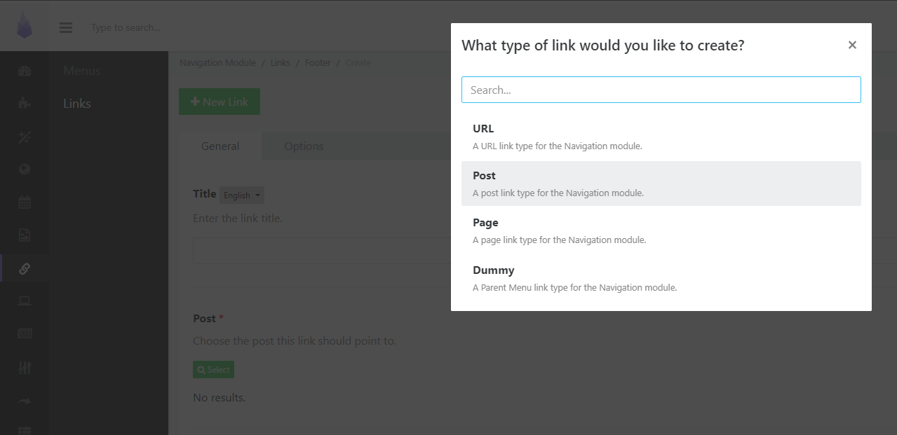

# POST Link Type Extension

A Post link type for the Navigation module.

This will give your users the option to add items from the Posts module to your navigation.




#### Version 1.0.0

*thrive.extension.post_link_type*


### Requirements

- PyroCMS 3.8

### Installation


1. Download to your PyroCMS installtion to a folder `/addons/default/thrive/`. This extension folder must be named `post_link_type-extension`.
2. Using terminal
```
composer dump-autoload
php artisan addon:install thrive.extension.post_link_type
```

